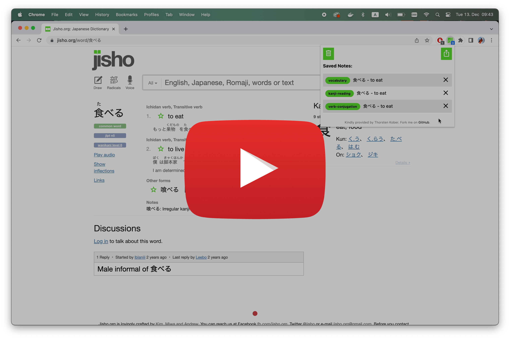

# Jisho Notes

[](https://youtu.be/_dQ6NKb1W2c)

## Note Types

### Kanji

[›› Example card](example-cards%2Fkanji-standalone%2Fwriting%2FREADME.md)

```
1. kanji    
2. meaning
3. jlpt-level
4. stroke-order   
```


### Kanji Reading

[›› Example card](example-cards%2Fkanji-compounds%2FREADME.md)

```
1. japanese (with furigana annotations)
2. english
3. type
4. jlpt-level   
5. supplemental-information
```


### Verb Conjugation

[›› Example card](example-cards%2Fverb-conjugations%2FREADME.md)

```
 1. japanese (with furigana annotations)
 2. english
 3. type
 4. jlpt-level   
 5. supplemental-information
 6. non-past-affirmative
 7. non-past-negative
 8. non-past-polite-affirmative
 9. non-past-polite-negative
10. past-affirmative
11. past-negative
12. past-polite-affirmative
13. past-polite-negative
14. te-form-affirmative
15. te-form-negative
16. potential-affirmative
17. potential-negative
18. passive-affirmative
19. passive-negative
20. causative-affirmative
21. causative-negative
22. causative-passive-affirmative
23. causative-passive-negative
24. imperative-affirmative
25. imperative-negative
```


### Adjective Conjugation

[›› Example card](example-cards%2Fadjective-conjugations%2FREADME.md)

```
 1. japanese (with furigana annotations)
 2. english
 3. type
 4. jlpt-level
 5. supplemental-information
 6. non-past-affirmative
 7. non-past-negative
 8. non-past-short-affirmative
 9. non-past-short-negative
10. past-affirmative 
11. past-negative
12. past-short-affirmative
13. past-short-negative
14. te-form
```


### Vocabulary

[›› Example card](example-cards%2Fvocabulary%2FREADME.md)

```
1. japanese (with furigana annotations)
2. english
3. type
4. jlpt-level
5. supplemental-information
```

